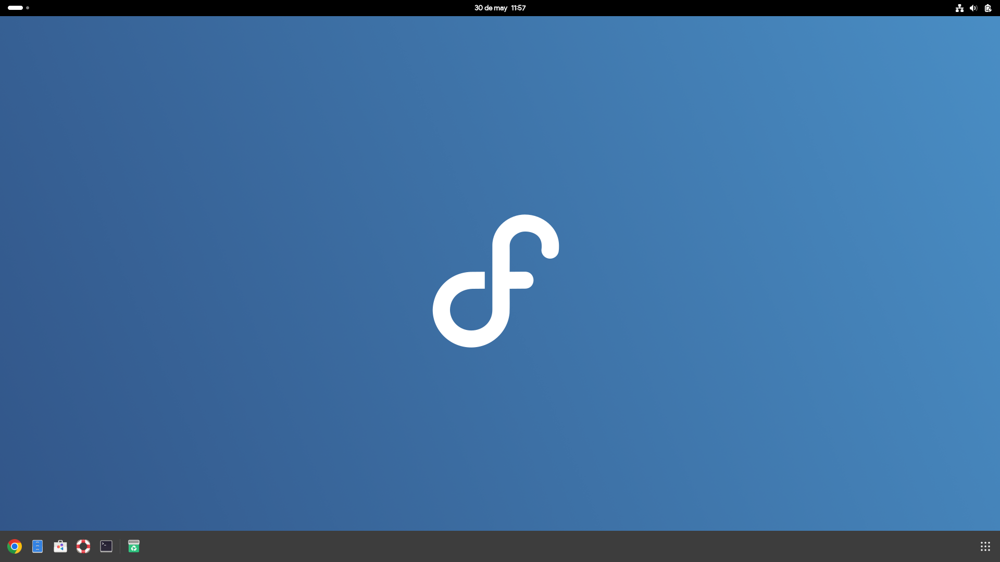
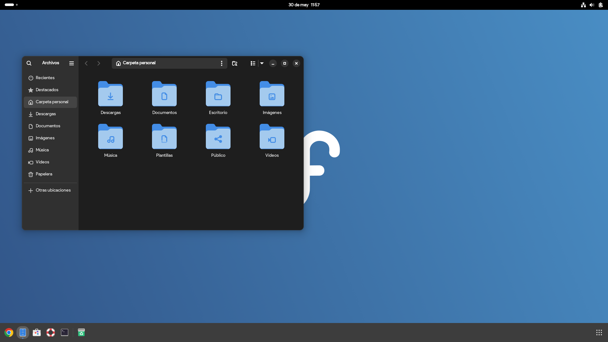
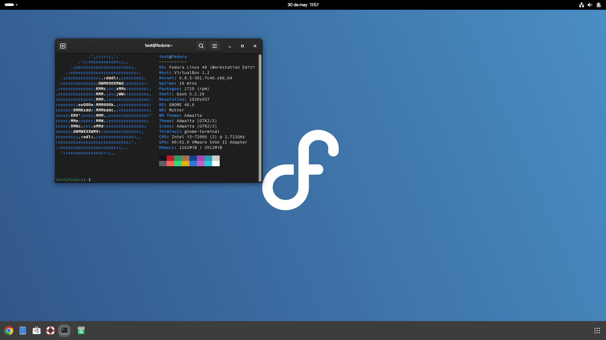

# 🎨 **Personalización y Optimización de Fedora 40**

El script realiza una serie de personalizaciones y optimizaciones en un sistema Fedora 40. El script mejora el rendimiento del sistema eliminando paquetes innecesarios y aplica una personalización que hace que el sistema sea más bonito a la simple vista y más fácil de usarlo.

El script solamente funcionará con escritorios **GNOME**.

## ⚙️ **A continuación se explicará el funcionamiento del Script**

### 1️⃣ Actualización del sistema
- El script actualizará tu sistema con las últimas versiones de software y parches de seguridad.

### 2️⃣ Eliminación de paquetes innecesarios
- Remueve automáticamente una serie de paquetes preinstalados que pueden no ser útiles para todos los usuarios, liberando espacio en disco y reduciendo el uso de recursos del sistema. Esto es especialmente útil en configuraciones de hardware con recursos limitados.

### 3️⃣ Limpieza de paquetes residuales del sistema
- Realiza una limpieza completa de paquetes residuales que hayan podido dejar los paquetes anteriormente eliminados, asegurando que el sistema esté lo más limpio posible, permitiendo un entorno de trabajo limpio y optimizado.

### 4️⃣ Instalación de software útil
- Se instalarán aplicaciones útiles como Google Chrome, neofetch, y bpytop, estas dos últimas para proporcionar herramientas adicionales para la personalización y el monitoreo.

### 5️⃣ Configuraciones estéticas del sistema
- El script aplica una serie de configuraciones estéticas ya preestablecidas para mejorar la apariencia y experiencia del sistema. Esto incluye la instalación de nuevas fuentes, fondos de pantalla, y temas de Plymouth para el arranque del sistema.

### 6️⃣ Reinicio automático
- El script reiniciará el sistema para aplicar los cambios realizados.

## ✏️ **Posibilidad de personalización del Script**

Este script puede ser modificado por el usuario para adaptarlo a sus necesidades, por ejemplo:

- **Agregar** o **eliminar** paquetes:
    - Modifica las listas de paquetes para instalar o desinstalar según tus preferencias.

- **Modificar** configuraciones estéticas:
    - Ajusta las configuraciones estéticas, como fondos de pantalla y temas, para que coincidan con tu estilo personal.

- **Ajustar** aspectos del Sistema:
    - Incorpora scripts adicionales o comandos personalizados para realizar tareas específicas que necesites en tu entorno de trabajo.

## 🚀 **Cómo ejecutar el Script**

1. Clona el repositorio con `git clone` o descárgalo a través de `wget`.
    ```sh
    git clone https://github.com/asenabre03/Fedora40.git
    wget https://github.com/asenabre03/Fedora40/archive/refs/heads/main.zip
    ```
2. Tendrás que tener **privilegios de superusuario** para poder ejecutar el script.
3. Utiliza los siguientes comandos para ejecutar el script:
    ```sh
    sudo chmod +x setup.sh
    sudo ./setup.sh
    ```

## 🖼️ **Imágenes**






